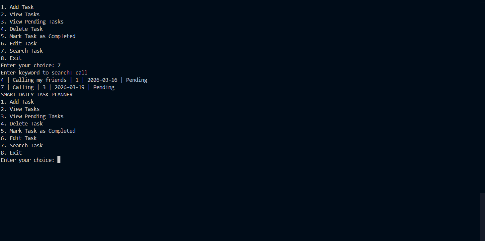
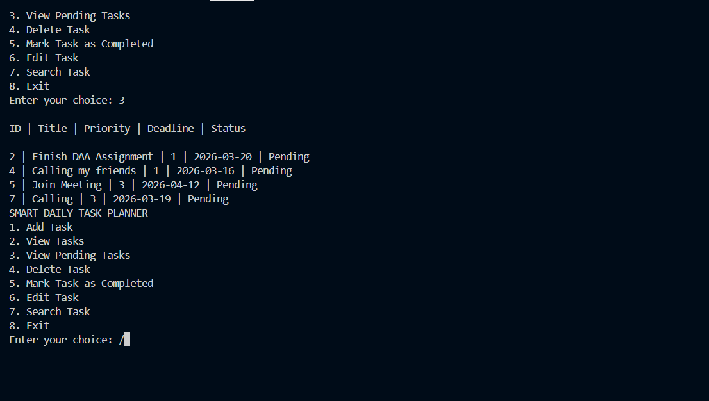

# Smart Task Planner

# Features
- Add tasks
- View tasks (sorted by priority & deadline)
- Delete tasks
- Mark tasks as completed
- Search tasks
- Filter pending tasks

# Technologies Used
- Python
- MySQL

# Concepts Used
- CRUD Operations
- SQL Queries (SELECT, INSERT, UPDATE, DELETE)
- Input Validation

# How to Run
1. Install MySQL
2. Run:
   python task_planner.
   
# Screenshots

